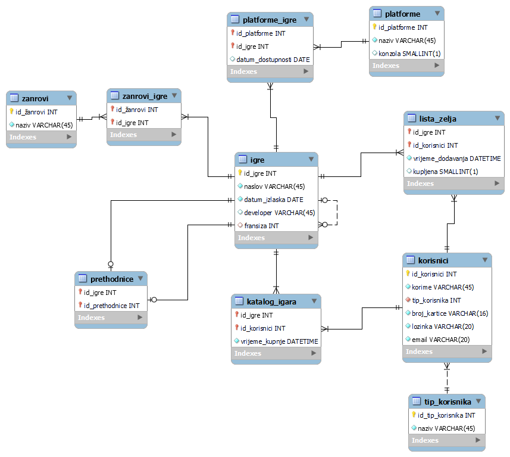
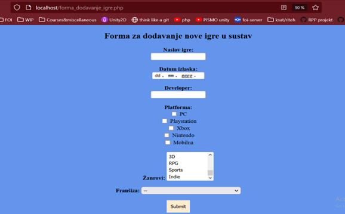
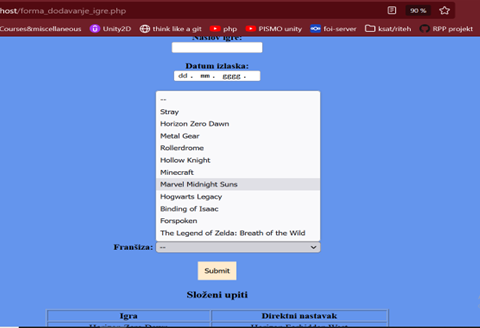
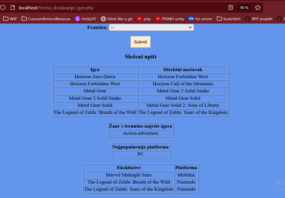
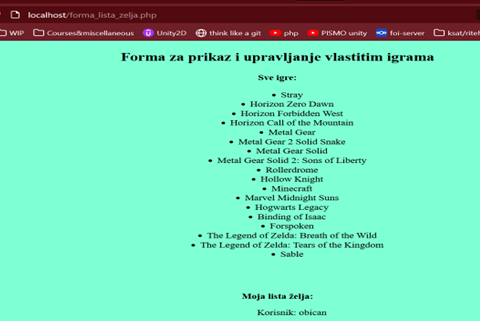
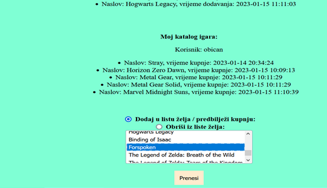
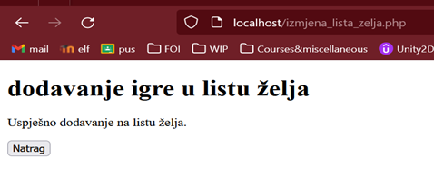

# Steam-lite
Project for university course Databases 2, a system inspired by Steam to shop for and manage video games.

This project describes an envisioned system for digital distribution of video games and the ERA model for such a system, as well as demonstrates its implementation in the MySQL DBMS and the MySQL Workbench database modeling and administration tool. Triggers and complex queries are used in the database implementation, forms are created using PHP in combination with HTML and CSS, and the local server XAMPP is used for communication with this MySQL database. Through the forms, adding a new game to the distribution system, adding and deleting an existing game from a user's wishlist, and trigger operation when modifying data in the wishlist are demonstrated. The forms also display information from the database to the user using complex queries.

Two forms have been created, the first of which allows for the input of new games into the system (into the game table) which can then be purchased if they are already available on the market, or added to the wishlist if they are not yet available. The second form displays all available games in the system, as well as the wishlist and game catalog belonging to the currently logged-in user. The user can add or delete specific games from their wishlist. The first form would only be accessible to users with the administrator role, as only administrators can add new games to the system. The second form is available to all users so they can view their own wishlists and catalogs and make changes.

## Technologies

- HTML/CSS for frontend
- PHP for database communication
- MySQL and MySQL Workbench for database and DBMS
- XAMPP for local server

## ERA model

## Demo

